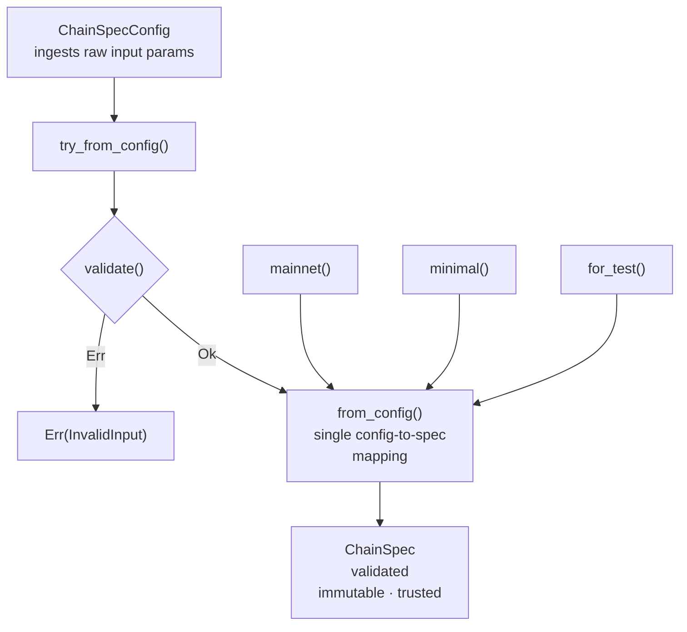

# `src/` — module map

How to think about each top-level module. Currently covers `config`; more
modules to be documented over time.

## `config` — the network rulebook & fork oracle
The `config` module is the single source of truth for **network parameters** and the **fork schedule**. The rest of the crate consults it for two things:
1. *A network's constants* — genesis time, seconds/slot, slots/epoch,
   sync-committee period math, committee size.  Each network defines its own fork rules/parameters.
2. *Which fork's rules/parameters apply (within a specific network) at a given slot/epoch*.

This module owns two consensus-critical, fork-dependent lookups:
- `fork_version_at_epoch` → the signing **domain** (sync-committee sig checks)
- `*_gindex(slot)` → the Merkle **generalized indices** (proof checks)

**The module holds no verification behavior** — no SSZ, Merkle, or signature logic, only data and pure lookups. Verification lives in `consensus/`, parameterized by what `config` returns:
> `config` module = inert, correctness-critical data + pure lookups
> `consensus` module = contains behavior driven by that data

### Two layers (parse, don't validate)
| Type | Role |
|------|------|
| `ChainSpecConfig` | Raw, untrusted **input**. Public fields, constructible/deserializable, *can be invalid*. |
| `ChainSpec` | The **validated, immutable** runtime object. `#[non_exhaustive]`, `const fn` accessors only. |

`try_from_config` validates; `from_config` is the *one* place the config→spec
mapping lives. Once code holds a `ChainSpec`, it trusts it.

The validated door (`try_from_config`) is the only path that checks input; the
trusted presets (`minimal`, `mainnet`, `for_test`) skip `validate()` as a
`const` construction optimization but still go through the single `from_config`
mapping. Their params are known-good, so `try_from_config` would accept them
just the same.

### Handle this module carefully
`config` sits near the **floor** of the dependency graph (depends only on `error` + `types::primitives`); nearly everything consensus-y depends on it. So it's foundational.  The module should be stable and low-churn.

It's also where each **new fork lands** (a `ForkParams`, a gindex arm, a fork version) as support advances (Deneb → Electra → Fulu).
