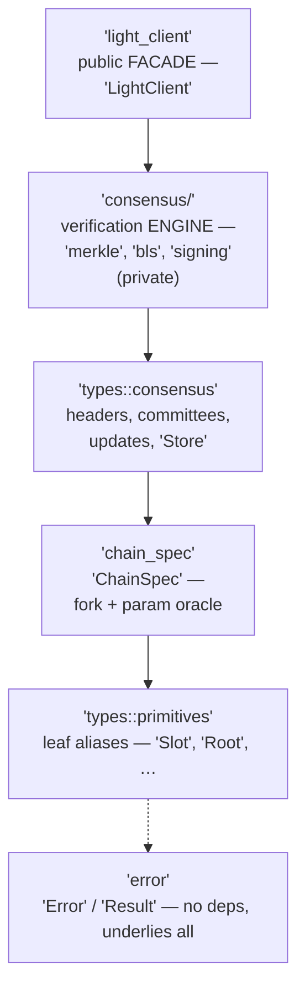
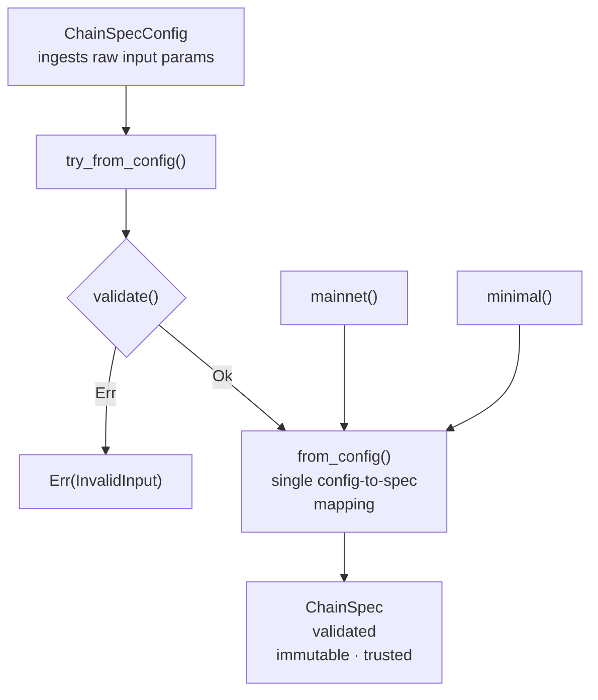

# `src/` — module map

A map of the crate: first how it's layered as a whole, then how to think about
each module. Per-module coverage starts with `chain_spec`; more added over time.

## Architecture — how the crate is layered
Nearly all of this crate is verification machinery, kept private in `consensus/` behind a thin `LightClient` facade. The other modules — `chain_spec` (network rules), `types`, and `error` — exist to feed that verification. The stack runs from the foundational floor (stable, correctness-critical) up to the public surface:

```mermaid
flowchart TD
    fac["'light_client'<br/>public FACADE —<br/>'LightClient'"]
    eng["'consensus/'<br/>verification ENGINE —<br/>'merkle', 'bls', 'signing'<br/>(private)"]
    ct["'types::consensus'<br/>headers, committees,<br/>updates, 'Store'"]
    cfg["'chain_spec'<br/>'ChainSpec' —<br/>fork + param oracle"]
    prim["'types::primitives'<br/>leaf aliases — 'Slot', 'Root', …"]
    err["'error'<br/>'Error' / 'Result' — no deps, underlies all"]

    fac --> eng --> ct --> cfg --> prim
    prim -.-> err
```

| Module | Layer | Role |
|--------|-------|------|
| `error` | floor | `Error` / `Result` |
| `types::primitives` | leaf | byte-array type aliases |
| `chain_spec` | oracle | `ChainSpec`: fork schedule + network params |
| `types::consensus` | data | fork-aware headers, committees, updates, store |
| `consensus/` | engine | SSZ / Merkle / BLS verification (private) |
| `light_client` | facade | `LightClient` (public entry) |

**Facade vs engine.** `LightClient` (`src/light_client.rs`) is a thin public wrapper; the real work lives in `LightClientProcessor` (`src/consensus/processor.rs`, `pub(crate)`). `process_light_client_update` delegates to the processor and returns its `UpdateChanges` receipt unchanged (the struct is defined in the engine and re-exported through the prelude). Consumers touch only the facade — `consensus/` is private. For the end-to-end verification **data flow** and the **correctness invariants** the engine maintains, see [`consensus/README.md`](consensus/README.md).

**The `types` umbrella spans two layers.** `types::primitives` sits *below* chain_spec (leaf aliases, no deps); `types::consensus` sits *above* it (its types carry a `&ChainSpec`). So `chain_spec` depends on `types::primitives` while `types::consensus` depends on `chain_spec`, which makes the crate-level `chain_spec ↔ types` edge *look* circular. It isn't — the real order is `primitives → chain_spec → consensus`; only the shared `types` name blurs it.

**`types::ssz` — the wire adapter.** Most public types decode themselves (`#[derive(Decode)]`); `BeaconBlockHeader` and the Capella+ headers are used directly as wire fields. What `ssz.rs` adds is the irreducible layer between the bytes and the public types: fork-dispatched wrapping of headers into the `LightClientHeader` enum, the spec's optional-field collapse (zeroed committee / finality on the wire → `None`), and the spec-sized sync committee and aggregate. That last one is why the private `Raw*` structs exist and why they are generic over `N`: the committee size (32 minimal, 512 mainnet) is a preset constant the wire layout *depends on* but the bytes *don't carry* — SSZ `Vector[T, N]` encodes no length — so the caller supplies `sync_committee_size` and the decoder picks the `N`. The same size-typed `Raw*` view is what `hash_tree_root` uses, since merkleizing a `Vector` needs `N` at compile time too; the public `SyncCommittee` deliberately stores a plain `Vec` and rebuilds the `Raw` view when it needs SSZ behavior in either direction. These generics never leave the module.

 

## `chain_spec` — the network rulebook & fork oracle
The `chain_spec` module is the single source of truth for **network parameters** and the **fork schedule**. The rest of the crate consults it for two things:
1. *A network's constants* — genesis time, seconds/slot, slots/epoch,
   sync-committee period math, committee size.  Each network defines its own fork rules/parameters.
2. *Which fork's rules/parameters apply (within a specific network) at a given slot/epoch*.

This module owns two consensus-critical, fork-dependent lookups:
- `fork_version_at_epoch` → the signing **domain** (sync-committee sig checks)
- `fork_at_slot` → which fork's rules apply; callers read fork-keyed constants
  off the returned `Fork` itself — e.g. the Merkle **generalized indices**
  (`fork.finalized_root_gindex()`), which are universal layout constants, not
  network data

**The module holds no verification behavior** — no SSZ, Merkle, or signature logic, only data and pure lookups. Verification lives in `consensus/`, parameterized by what `chain_spec` returns:
> `chain_spec` module = inert, correctness-critical data + pure lookups
> `consensus` module = contains behavior driven by that data

### Two layers (parse, don't validate)
| Type | Role |
|------|------|
| `ChainSpecConfig` | Raw, untrusted **input**. Public fields, freely constructible, *can be invalid*. |
| `ChainSpec` | The **validated, immutable** runtime object. Private fields, `const fn` accessors only. |

`try_from_config` validates; `from_config` is the *one* place the config→spec
mapping lives. Once code holds a `ChainSpec`, it trusts it.

```mermaid
flowchart TD
    cfg["ChainSpecConfig<br/> ingests raw input params"]

    cfg --> tfc["try_from_config()"]
    tfc --> v{"validate()"}
    v -->|Err| err["Err(InvalidInput)"]
    v -->|Ok| fc["from_config()<br/>single config-to-spec<br/>mapping"]

    main["mainnet()"] --> fc
    min["minimal()"] --> fc

    fc --> spec["ChainSpec<br/>validated<br/>immutable · trusted"]
```

The validated door (`try_from_config`) is the only path that checks input; the
trusted presets (`minimal`, `mainnet`) skip `validate()` as a `const`
construction optimization but still go through the single `from_config`
mapping. Their params are known-good, so `try_from_config` would accept them
just the same.

### Module conventions

- **Types:** spec-arithmetic quantities (slots, epochs, seconds) are `u64` — the
  spec-defined width, platform-independent. Collection lengths
  (`sync_committee_size`) are `usize` — Rust's memory-index type. The two
  domains never mix, so no casts.
- **Naming:** `x_to_y()` = pure arithmetic conversion between time units;
  `x_at_y()` = schedule-dependent lookup ("what was in effect at this point").

### Handle this module carefully
`chain_spec` sits near the **floor** of the dependency graph (depends only on `error` + `types::primitives`); nearly everything consensus-y depends on it. So it's foundational.  The module should be stable and low-churn.

It's also where each **new fork lands** (a `ForkParams`, a gindex arm, a fork version) as support advances (Deneb → Electra → Fulu).

What each fork changed, light-client-wise (`Fork` enum variants, in order):

| Fork | LC-relevant change |
|------|--------------------|
| Altair (Oct 2021) | Light client protocol introduced |
| Bellatrix (Sep 2022) | The Merge; no LC header changes |
| Capella (Apr 2023) | LC header gains the execution payload header + inclusion branch |
| Deneb (Mar 2024) | Blobs/4844; execution payload header adds blob-gas fields |
| Electra (2025) | Pectra; BeaconState restructured — gindices shift, proof branches deepen |
