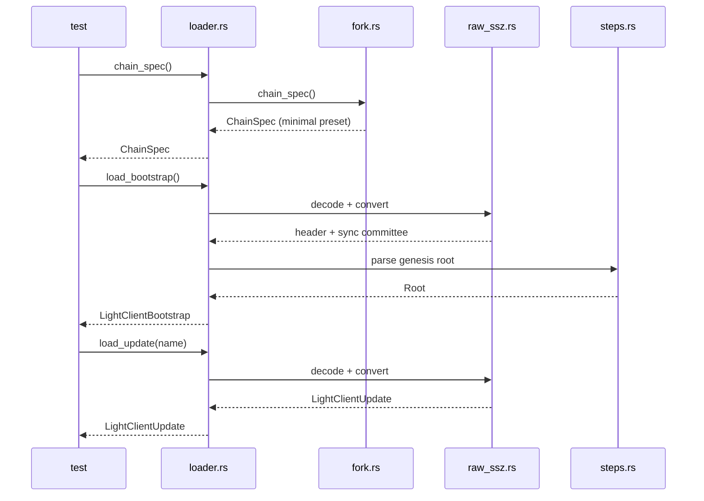

# Test Utilities (unstable)

**Not part of the stable public API.** This module is gated behind the
`test-utils` feature and may change or be removed without notice.

Enable with:

```toml
[dev-dependencies]
eth-light-client = { version = "0.1", features = ["test-utils"] }
```

It loads the vendored Ethereum consensus **light-client spec-test fixtures**
off disk and returns them as the crate's production types, so tests can drive
the light client against the official vectors with no network or beacon node.

## Module map

| File | Responsibility |
|------|----------------|
| `loader.rs` | `SpecTestLoader` — the entry point; reads fixture files and returns typed objects |
| `raw_ssz.rs` | `Raw*` SSZ structs + the `raw_*_to_pub` raw→production converters |
| `steps.rs` | YAML fixture types (`meta.yaml` / `steps.yaml`) + the `hex_to_root` / `beacon_header_matches` fixture helpers |
| `fork.rs` | `MinimalPresetFork` — the minimal-preset fork tag and its `ChainSpec` |
| `mod.rs` | module wiring / re-exports |

## Fixtures

Each fork's fixture directory (`tests/fixtures/minimal/<fork>/…`) holds the
consensus objects as SSZ (the light client's inputs) alongside YAML that
scripts the test:

| File | Contents |
|------|----------|
| `bootstrap.ssz_snappy` | The trusted starting point — a header plus the current sync committee and its merkle proof. |
| `update_<hash>.ssz_snappy` | One light-client update — attested/finalized headers with their branches, the sync aggregate (signature), and an optional next sync committee. |
| `meta.yaml` | Test metadata — the genesis validators root and fork digests. |
| `steps.yaml` | The script — an ordered list of updates to apply (each with a `current_slot`) and the header state expected after each. |
| `config.yaml` | The preset config the vectors were generated with; unused here, since the harness hardcodes the minimal preset. |

## Data flow

`SpecTestLoader` is only the **orchestrator**: it picks a file, decodes it into
a `Raw*` struct, calls the `raw_ssz` converters to produce the production type,
and assembles the result. The two hops live in two places — decoding in the
loader, converting in `raw_ssz`.



The `test` then feeds the returned `LightClientBootstrap` / `LightClientUpdate`
into `LightClient::new` / `process_update` — the code actually under test.


## Usage

```rust,ignore
use eth_light_client::test_utils::SpecTestLoader;
use eth_light_client::{ChainSpec, LightClient};

let loader = SpecTestLoader::minimal_altair_sync();

let mut client = LightClient::new(
    loader.chain_spec(),
    loader.load_bootstrap()?,
)?;

for step in loader.load_steps()? {
    // feed loader.load_update(&step.update) into client,
    // then compare client's headers against step.checks
}
```

Only the three `minimal_*_sync()` constructors exist — the harness is
minimal-preset only (fixture shapes *and* chain config), by design.
