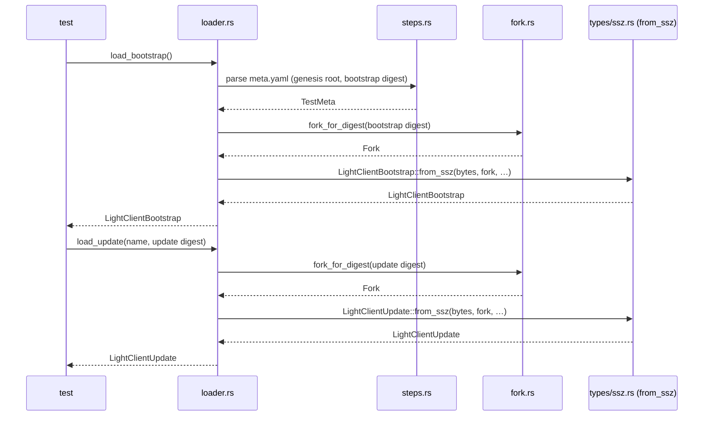

# Test Utilities (unstable)

**Not part of the stable public API.** This module is gated behind the
`test-utils` feature and may change or be removed without notice.

Enable with:

```toml
[dev-dependencies]
eth-light-client = { version = "0.1", features = ["test-utils"] }
```

It loads the vendored Ethereum consensus **light-client spec-test fixtures**
off disk and returns them as the crate's production types, so tests can drive
the light client against the official vectors with no network or beacon node.

## Module map

| File | Responsibility |
|------|----------------|
| `loader.rs` | `SyncTestCase` — the entry point; holds a fixture directory plus a chain schedule, reads the fixture files, and decodes each object under the fork its own fixture digest names |
| `steps.rs` | YAML fixture types (`meta.yaml` / `steps.yaml`; hex roots and fork digests parsed at load) + `beacon_header_matches` |
| `fork.rs` | Per-fork fixture dirs + toy-chain schedules (`fixture_dir`, `single_fork_config`), the cross-fork schedule, and `fork_for_digest` (fixture digest → `Fork`) |
| `mod.rs` | module wiring / re-exports |

## Fixtures

Each fork's fixture directory (`tests/fixtures/minimal/<fork>/…`) holds the
consensus objects as SSZ (the light client's inputs) alongside YAML that
scripts the test:

| File | Contents |
|------|----------|
| `bootstrap.ssz_snappy` | The trusted starting point — a header plus the current sync committee and its merkle proof. |
| `update_<hash>.ssz_snappy` | One light-client update — attested/finalized headers with their branches, the sync aggregate (signature), and an optional next sync committee. |
| `meta.yaml` | Test metadata — the genesis validators root, trusted block root, and fork digests (`bootstrap_fork_digest` drives bootstrap decode). |
| `steps.yaml` | The script — an ordered list of steps (updates to apply, each with a `current_slot` and its own `update_fork_digest`; store-upgrade checkpoints at fork boundaries) and the header state expected after each. |
| `config.yaml` | The config the vectors were generated with; the drift-guard tests in `fork.rs` assert the hardcoded schedules match it. |

## Data flow

`SyncTestCase` is only the **orchestrator**: it snappy-decompresses a
fixture file, resolves the fork named by that object's fixture digest, and
hands the raw SSZ to the crate's public `from_ssz` decoders (the fork-dispatched
wire adapter in `types/ssz.rs`). Decode always follows what the fixture says —
never a per-test fork assumption — which is what lets one test span forks
(cross-fork sequences interleave update formats, and pre-fork updates keep
arriving after the chain forks).


```mermaid
sequenceDiagram
    participant T as test
    participant L as loader.rs
    participant S as steps.rs
    participant F as fork.rs
    participant P as types/ssz.rs (from_ssz)

    T->>L: load_bootstrap()
    L->>S: parse meta.yaml (genesis root, bootstrap digest)
    S-->>L: TestMeta
    L->>F: fork_for_digest(bootstrap digest)
    F-->>L: Fork
    L->>P: LightClientBootstrap::from_ssz(bytes, fork, …)
    P-->>L: LightClientBootstrap
    L-->>T: LightClientBootstrap

    T->>L: load_update(name, update digest)
    L->>F: fork_for_digest(update digest)
    F-->>L: Fork
    L->>P: LightClientUpdate::from_ssz(bytes, fork, …)
    P-->>L: LightClientUpdate
    L-->>T: LightClientUpdate
```

The `test` then feeds the returned `LightClientBootstrap` / `LightClientUpdate`
into `LightClient::new` / `process_update` — the code actually under test.


## Usage

```rust,ignore
use eth_light_client::test_utils::SyncTestCase;
use eth_light_client::{Fork, LightClient};

let sync_test = SyncTestCase::new(Fork::Altair);

let mut client = LightClient::new(
    sync_test.chain_spec(),
    sync_test.load_bootstrap()?,
)?;

for step in sync_test.load_steps()? {
    // feed sync_test.load_update(&step.update, step.update_fork_digest)
    // into client, then compare client's headers against step.checks
}
```

The constructors are `new(fork)` (the single-fork `light_client_sync` case)
plus the cross-fork `deneb_electra_fork()`. The harness is minimal-preset only
(fixture shapes *and* chain config), by design.
